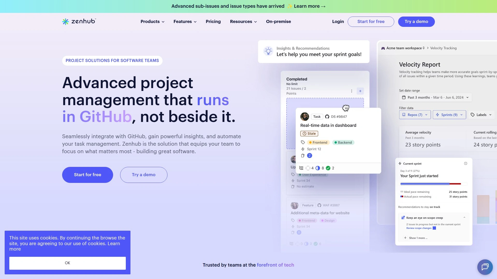

# Top 15 Best Agile Project Management Tools in 2025

You know that feeling when your team is drowning in Slack threads, someone can't find last week's sprint notes, and nobody's quite sure which tasks are actually getting done today? Yeah, that's the chaos agile project management software is supposed to fix. The tools below aren't just digital bulletin boards where tasks go to die—they're systems that actually help cross-functional teams plan sprints, track progress, and ship features without losing their minds.

Whether you need kanban boards for visual workflow management, scrum boards with burndown charts, or just a way to stop asking "wait, what are we working on again" in every standup, there's genuinely something here that clicks with how your team operates. From open source platforms you can customize endlessly to polished commercial tools with AI automation, these options range from dead-simple to enterprise-grade. The goal is finding software that fits your workflow instead of forcing your team into rigid processes nobody asked for.

***

## **[Taiga](https://taiga.io)**

The open-source agile platform built specifically for cross-functional teams that need both kanban and scrum capabilities without the enterprise price tag or complicated setup.

Taiga delivers a complete set of agile tools through an intuitive interface that requires zero training to start using. The platform supports both kanban and scrum methodologies, and you can switch between them freely as your project needs change. For kanban workflows, you get customizable boards with WIP limits, swim lanes for multiple workflows, extensive filtering, and zoom levels to manage visual density. The scrum side includes backlog management with epics and sub-tasks, sprint planning with estimation tools, a sprint task board with swim lanes per user story, and burndown charts at both project and sprint levels.

Issues and bug tracking integrate directly into the workflow rather than living in a separate system. You can customize issue types, priorities, and severities, add issues directly to sprints, and promote issues to user stories when scope expands. The platform provides team performance dashboards including a team health function, full project timeline audibility, personal dashboards with notifications, and a wiki for documentation. Custom reports export via CSV with URL links for integration into your own data tools.

The self-hosted option appeals to larger teams or multiple small teams needing data on their own servers with customization freedom. Updates are straightforward, you choose which community contributions to integrate, and it's translated into over 20 languages. The embedded onboarding guides new users through features progressively, and project import/export functions prevent lock-in.

Taiga positions itself as lightweight yet complete—teams looking for open-source project management without compromising functionality find it particularly suitable. The visual organization and flexibility between agile methodologies make it accessible for teams still figuring out their ideal workflow. While reporting features are basic compared to enterprise tools, the core agile functionality delivers what most teams actually need daily.

---

## **[Jira](https://www.atlassian.com/software/jira)**

The heavyweight agile standard from Atlassian that handles complex enterprise workflows, extensive customization, and serious sprint management for software development teams who need everything.

Jira dominates the enterprise agile space because it genuinely handles complexity that breaks simpler tools. The platform supports intricate workflows with custom statuses, automated transitions, and conditional logic that matches your actual development process. For scrum teams, you get sophisticated sprint planning with story points, velocity tracking, detailed burndown and burnup charts, and capacity management across multiple teams.

The backlog management system lets you organize stories with epics, create sub-tasks, estimate complexity, and prioritize based on business value or technical dependencies. Kanban boards include advanced features like cumulative flow diagrams, cycle time analysis, and bottleneck identification. Issue tracking goes far beyond basic task management—custom fields, automated assignees based on rules, issue linking to show dependencies, and version tracking for release management.

Integration capabilities are massive. Jira connects with virtually every development tool including GitHub, Bitbucket, GitLab, Slack, Confluence, and hundreds more through the marketplace. This makes it central to development workflows where code commits link to issues, pull requests update task status automatically, and deployment triggers notifications.

The downside is genuine—Jira has a steep learning curve and requires deliberate configuration to avoid becoming overcomplicated. Teams with simple needs often find it overwhelming, but for software development teams managing multiple complex projects with detailed tracking requirements, it delivers unmatched power. It's particularly strong for larger teams (25+ people) or organizations standardizing processes across departments.

***

## **[Trello](https://trello.com)**

The visual task management tool with the simplest interface and easiest learning curve, using boards, lists, and cards to organize work without overwhelming anyone with features.

Trello pioneered the digital kanban approach that feels natural to almost everyone who tries it. You create boards for projects, lists for workflow stages (like "To Do," "In Progress," "Done"), and cards for individual tasks. Dragging cards between lists provides immediate visual feedback about work progress. The interface is clean and uncluttered, making it accessible for non-technical teams and those new to project management tools.

Butler automation handles recurring tasks, rule-based card movements, and scheduled actions without manual intervention. Power-ups extend functionality with calendar views, custom fields, voting, and integrations with external tools like Slack, Google Drive, and GitHub. The system works particularly well for marketing teams, designers, and creative projects where visual organization matters more than complex dependencies.

Trello's strength is also its limitation—simplicity means it lacks robust features for complex project management. There's no native time tracking, resource management tools are minimal, and reporting capabilities are basic. For straightforward projects with small to medium teams (under 15 people), this simplicity is exactly right. For software development with dependencies, sprints, and detailed metrics, it feels insufficient.

The free version supports unlimited users and boards, making it genuinely accessible for small teams and personal use. Paid tiers add unlimited Power-ups, advanced automation, and additional board views. It's ideal for teams wanting organization without complexity, or as a lightweight task tracker alongside heavier tools.

***

## **[Asana](https://asana.com)**

The versatile project management platform offering list, board, calendar, and timeline views with strong collaboration features and integrated time tracking for teams needing more than Trello but less than Jira.

Asana provides multiple view types for the same data—list view for detailed task management, board view for kanban workflows, calendar view for deadline tracking, and timeline view (Gantt charts) for dependencies. This flexibility lets different team members work in their preferred style while looking at shared information. Task dependencies, custom fields, tags, and templates create structure without rigidity.

The collaboration features include task assignments with multi-person responsibility, subtasks for breaking down work, commenting threads on tasks, file attachments, and real-time updates across the team. Project portfolios give managers a bird's-eye view of multiple projects simultaneously, showing status, progress, and bottlenecks. The integrated time tracking (basic) and workload management tools help prevent team burnout.

Workflow automation through Rules automates repetitive actions like moving tasks between sections, changing assignees, or updating custom fields based on triggers. Integration with Google Drive, Slack, Zapier, Dropbox, and Salesforce connects Asana to existing workflows. The platform works well for cross-functional teams managing diverse project types—from marketing campaigns to product launches to event planning.

The interface maintains intuitive usability while offering significantly more depth than Trello. It's particularly strong for teams of 10-50 people who've outgrown simple tools but don't need enterprise-level complexity. The free version supports teams up to 15 people with basic features, while paid plans unlock timeline views, advanced search, and custom fields.

***

## **[Monday.com](https://monday.com)**

The highly customizable work operating system with visual workflows, powerful automation, and extensive integrations that adapts to virtually any team structure or industry.

Monday.com's core strength is customization—boards, columns, and workflows configure to match your exact processes rather than forcing you into predetermined structures. You can create columns for status, people, timelines, numbers, files, and dozens of other data types, then view the same data through different lenses like kanban, Gantt, calendar, or map views. This flexibility makes it suitable for industries from construction to marketing to software development.

Automation capabilities are advanced compared to most competitors, with 250+ templates for common workflows plus custom rule creation. You can automate task assignments based on status changes, send notifications when deadlines approach, create recurring tasks, and integrate actions across multiple boards. Real-time collaboration includes commenting, file sharing, team notifications, and activity tracking.

The platform provides robust reporting with customizable dashboards that pull data from multiple boards, showing progress metrics, timeline projections, workload distribution, and budget tracking. Integration with Slack, Google Drive, Zapier, Dropbox, Microsoft Teams, and Salesforce connects to broader workflows. Teams appreciate the visual design—color-coded statuses and progress bars make project health immediately obvious.

The downsides are the learning curve and setup time—Monday.com requires investment to configure properly, which can feel overwhelming initially. Once configured, it's powerful, but teams wanting quick deployment might struggle. Pricing sits higher than basic tools, though the feature depth justifies it for teams needing serious customization. It's particularly valuable for agencies, project-based businesses, and operations teams managing complex, varied workflows.

***

## **[ClickUp](https://clickup.com)**

The all-in-one project management solution with everything-and-the-kitchen-sink features including docs, goals, time tracking, and mind maps, aiming to replace multiple tools with one platform.

ClickUp organizes work into Spaces, Folders, Lists, and Tasks with incredible customization at each level. You can add as many view types as you want to any project—List, Board, Calendar, Box, Timeline, Gantt, Activity, and Mind Map views all coexist. The Everything section provides a unified view of all your work across projects, which is genuinely convenient when you're juggling multiple initiatives.

Built-in docs (similar to Notion) let you create wikis, project briefs, and documentation directly in the platform. Goals and OKR tracking connects daily tasks to strategic objectives. Time tracking integrates natively rather than requiring third-party tools. Mind maps help visualize project structure and brainstorm new initiatives. The breadth of features means you might genuinely replace Trello, Google Docs, time tracking apps, and goal software with one tool.

Automation handles workflow rules, task assignments, status updates, and recurring work. Custom fields add any data type you need—dropdowns, ratings, checkboxes, calculations, and more. The free version supports unlimited users, which is rare for tools with this feature depth. Paid tiers add unlimited integrations, advanced automation, and additional storage.

The challenges are real—ClickUp can be slow and buggy, particularly with large projects or many integrations running. The interface feels cluttered because there are simply so many features competing for attention. Notifications can flood users if not configured carefully. For teams wanting a single platform to rule them all and willing to invest time learning it, ClickUp delivers incredible value. For teams wanting simplicity, it's overwhelming.

---

## **[OpenProject](https://www.openproject.org)**

The open-source project management software with enterprise features like Gantt charts, time tracking, and cost reporting, ideal for teams needing robust capabilities without vendor lock-in.

OpenProject provides comprehensive project management functionality through open-source software you can self-host or use via cloud hosting. The platform includes traditional project management tools like Gantt charts with dependencies, milestones, and critical path highlighting alongside agile boards for scrum and kanban workflows. This combination serves teams using hybrid methodologies or managing diverse project types.

Time and cost tracking integrate directly into tasks, allowing budget monitoring, resource allocation, and profitability analysis. Work package management (their term for tasks/issues) includes custom fields, status workflows, and hierarchical structures for complex projects. The team planner provides resource capacity views showing who's available and who's overloaded.

Meeting management tools handle agenda creation, minute documentation, and action item tracking—useful for teams with heavy meeting cadences. Wikis provide project documentation spaces, and forums support asynchronous team discussions. The self-hosted option appeals to organizations with security requirements, compliance needs, or customization desires that commercial SaaS platforms can't accommodate.

The interface looks more traditional than modern tools like Monday.com or Asana, which some users find less intuitive. However, for teams familiar with tools like Microsoft Project or those requiring detailed project planning capabilities, it provides familiar functionality. The open-source nature means no per-user licensing costs for self-hosted deployments, though cloud plans are available for teams preferring managed hosting. It's particularly suitable for engineering teams, IT departments, and organizations managing construction, manufacturing, or complex multi-phase projects.

***

## **[Notion](https://notion.so)**

The flexible workspace combining docs, wikis, databases, and project management in one interconnected system, perfect for teams wanting documentation and task management unified.

Notion's core concept is blocks—everything from text to images to databases to kanban boards exists as blocks you can arrange, nest, and link together. This creates incredibly flexible workspaces where project documentation, meeting notes, and task boards live in context rather than scattered across separate tools. You can embed a kanban board inside a project spec document, link tasks to their relevant design files, and create relational databases connecting projects to resources to timelines.

The database functionality provides filtered views, allowing one underlying dataset to display in multiple ways—kanban for workflow visualization, calendar for deadline tracking, table for detailed editing, gallery for visual content. Templates and page structures speed up common workflows like meeting notes, project briefs, and sprint planning. The collaborative editing works smoothly for real-time team work on shared documents.

Notion excels as a knowledge base and documentation system, making it popular with content teams, product teams, and companies building internal wikis. The project management features are functional but less robust than dedicated tools—no native Gantt charts, limited automation, and basic time tracking. For teams prioritizing documentation alongside task management, the integration is incredibly valuable.

The learning curve exists—Notion's flexibility means you need to design your own workspace structure, which feels daunting initially. Once configured, it becomes indispensable for documenting processes, managing knowledge, and tracking work in connected contexts. Pricing is reasonable with a generous free tier, making it accessible for small teams and startups. It's ideal for product teams, remote companies with heavy documentation needs, and creative teams managing projects alongside content creation.

***

## **[Airtable](https://airtable.com)**

The database-spreadsheet hybrid with relational capabilities that connects projects, tasks, and data across teams, scaling to 250,000 records per table for serious data management.

Airtable combines familiar spreadsheet interfaces with relational database power—tables link to each other, creating connections between projects, contacts, assets, and tasks. This relational structure eliminates duplication and ensures updates sync everywhere the data appears. You can build custom apps on top of your data using drag-and-drop interfaces without coding.

Multiple view types transform the same data for different purposes—grid view for data entry, kanban for workflow visualization, calendar for scheduling, gallery for visual content, and form view for data collection. Custom fields include attachments, checkboxes, dropdowns, formulas, linked records, and rollups that aggregate data from connected tables. Built-in AI automates categorization, summarization, and translation tasks.

Airtable scales significantly—supporting 250,000 records per table compared to limitations in tools like Smartsheet (20,000 rows). The API is robust, enabling custom integrations and automated workflows through tools like Zapier or custom scripts. This makes it suitable for complex operations beyond simple project management—content calendars linking to asset libraries, product roadmaps connected to customer feedback databases, event planning with vendor and venue tracking.

The database-first approach means steeper learning curves than simple task tools. Teams need to think about data structure and relationships rather than just adding tasks to boards. For marketing teams managing campaigns with multiple assets, product teams tracking features across releases, or operations teams managing inventory and projects simultaneously, the flexibility justifies the complexity. It's powerful for teams that have outgrown spreadsheets but need more structure than traditional project tools provide.

***

## **[Wrike](https://www.wrike.com)**

The enterprise-grade project management platform with advanced resource management, custom workflows, and detailed reporting for agencies and professional services firms managing client work.

Wrike provides comprehensive project planning with Gantt charts, dependencies, critical path analysis, and baseline comparisons to track how actual progress compares to original plans. Resource management tools show team capacity, workload distribution, and availability, helping prevent burnout and optimize allocation. Custom workflows with approval processes, automated routing, and status tracking handle complex client review cycles common in agency environments.

Time tracking integrates natively with tasks, enabling accurate billing, profitability analysis, and productivity insights. The request forms feature creates intake processes for new projects or client requests, automatically converting submissions into properly structured tasks. Proofing and approval tools let stakeholders review creative assets, leave feedback directly on files, and approve work without email threads.

Dashboards and reporting provide customizable views of project health, resource utilization, timeline projections, and budget status. Real-time collaboration includes task comments, file sharing, live editing, and @mentions. The platform integrates with Salesforce, Adobe Creative Cloud, Slack, Microsoft Teams, and other agency-critical tools.

Wrike's complexity and pricing position it for mid-to-large teams (20+ people) or agencies managing multiple client projects simultaneously. The setup requires investment—configuring custom workflows, setting up resource management, and training teams. For professional services firms needing client-facing project visibility, detailed billing, and complex approval workflows, Wrike delivers specialized capabilities that general tools lack. It's less suitable for internal product teams or simple project tracking.

***

## **[Basecamp](https://basecamp.com)**

The straightforward project management tool emphasizing simplicity and team communication over complex features, with flat pricing regardless of user count that makes budgeting predictable.

Basecamp organizes work into projects containing message boards, to-do lists, schedules, docs, and file storage. Message boards handle team discussions and announcements with threaded comments. To-do lists break work into actionable tasks with assignments and due dates. The schedule shows all deadlines and milestones across projects in calendar format.

The Campfire chat feature provides real-time communication for quick questions and casual conversation. Automatic check-ins prompt team members to answer recurring questions (like "What did you work on today?") without manual reminders. The Hey menu consolidates all notifications, mentions, and assignments in one place rather than fragmenting attention across different project areas.

Basecamp's philosophy deliberately avoids feature bloat—no time tracking, no Gantt charts, no resource management, no complex workflows. This simplicity appeals to teams overwhelmed by tool complexity who just need organized communication and task lists. The flat pricing structure ($299/month for unlimited users) makes it economically attractive for larger teams where per-user pricing becomes expensive.

The limitations are significant for teams needing advanced project management—no dependencies, limited reporting, basic integrations compared to competitors. For agencies, consultants, and smaller companies managing straightforward client work or internal projects, the simplicity is exactly right. Remote teams particularly appreciate the asynchronous communication tools that reduce meeting dependence. It works less well for agile software development or complex multi-phase projects requiring detailed tracking.

***

## **[Smartsheet](https://www.smartsheet.com)**

The spreadsheet-based project management platform combining familiar Excel-like interfaces with Gantt charts, forms, and automation for teams comfortable with spreadsheet workflows.

Smartsheet uses spreadsheet architecture as the foundation, making it immediately familiar to anyone comfortable with Excel. Rows represent tasks or items, columns hold various data types (text, dates, dropdowns, formulas), and sheets connect through cell linking. This approach works exceptionally well for project managers with spreadsheet backgrounds transitioning to more collaborative tools.

Gantt chart views automatically generate from date columns, showing timelines, dependencies, and critical paths. Card view provides kanban-style visualization of the same data. Forms collect information from stakeholders or team members, automatically populating sheet rows with submissions. Dashboards aggregate data from multiple sheets with charts, metrics, and status indicators for executive reporting.

Automation handles approvals, notifications, task assignments, and recurring updates through workflow rules. The platform includes robust permission controls, audit trails, and compliance features important for enterprises and nonprofits managing grants or regulatory requirements. Integration with Microsoft Office, Google Workspace, Salesforce, and project management tools connects Smartsheet to broader workflows.

The spreadsheet structure becomes limiting for complex relational data—you can't truly connect data like a database, which leads to duplication and sync challenges. Smartsheet is capped at 20,000 rows per sheet, restricting use cases requiring massive data. For project managers needing rigorous PM functionality including Gantt charts, resource management, and detailed tracking with spreadsheet familiarity, Smartsheet delivers. For teams building interconnected systems or needing database flexibility, tools like Airtable work better.

***

## **[Zenhub](https://www.zenhub.com)**

The project management extension natively integrated into GitHub's interface, providing agile boards, sprints, and reporting without leaving the developer environment.

Zenhub lives directly inside GitHub, adding project management capabilities to the familiar code repository interface developers already use daily. This native integration means issues in GitHub automatically appear on Zenhub boards, pull requests link to tasks, and code commits update project status seamlessly. Developers never need to context-switch to separate project management tools.

Multi-level project hierarchy supports Sub-issues, Tasks, Epics, Projects, and Objectives in alignment with GitHub's structure. Customizable kanban boards visualize workflow with columns matching your process. Sprint planning tools help estimate capacity, assign work, and track velocity across iterations. Advanced reporting includes sprint reports, velocity charts, burndown graphs, cumulative flow diagrams, and control charts that tap directly into GitHub data for real-time insights.

AI features generate acceptance criteria for user stories, suggest labels automatically, and provide sprint planning assistance. Automation integrates with GitHub webhooks to minimize manual updates—issues move between columns based on PR status, labels apply automatically based on content, and notifications trigger for relevant team members. The Team Feed automates daily standups by summarizing what everyone worked on based on actual code activity.

Zenhub requires GitHub as the foundation, making it specifically for software development teams already using GitHub. Non-developers can't easily participate since the interface lives inside a code repository tool. For engineering teams at companies like NASA, Comcast, and Microsoft who want agile project management without abandoning GitHub, Zenhub provides purpose-built functionality. For mixed teams or non-technical projects, standalone tools work better.

***

## **[Linear](https://linear.app)**

The modern issue tracking tool emphasizing speed, keyboard shortcuts, and clean design for software teams who want streamlined workflows without bloated enterprise features.

Linear prioritizes speed and simplicity—the interface loads instantly, keyboard shortcuts handle nearly every action, and the design removes unnecessary visual clutter. This focus on performance makes daily use feel frictionless compared to slower, heavier tools. Issues create quickly with minimal required fields, then gain detail as work progresses rather than demanding comprehensive information upfront.

The platform supports agile workflows with projects, cycles (their term for sprints), and roadmaps. Issues organize into projects with statuses, priorities, and assignees. Cycles provide time-boxed work periods with automatic rollover of incomplete work. Roadmaps visualize planned features across quarters with progress tracking. The simplicity is deliberate—fewer features executed excellently rather than feature bloat.

Integration with GitHub, GitLab, Slack, and Figma keeps developers connected without overwhelming options. Keyboard-first design appeals to developers comfortable with terminal and code editors who find mouse-heavy interfaces slow. The modern aesthetic and smooth interactions create pleasant daily experiences.

Linear works best for startup and scale-up engineering teams (10-100 people) valuing agility over enterprise governance. The streamlined approach lacks extensive customization, complex workflows, and detailed resource management that enterprises require. For software teams frustrated by Jira's complexity but needing more structure than Trello, Linear hits a sweet spot. It's less suitable for non-technical teams or organizations requiring extensive customization and rigid process enforcement.

---

## **[Zoho Projects](https://www.zoho.com/projects/)**

The comprehensive project management solution from Zoho's business software suite, offering Gantt charts, time tracking, and collaboration tools with tight integration across Zoho applications.

Zoho Projects provides traditional project management with Gantt charts, task dependencies, milestones, and critical path analysis. Task management includes assignments, subtasks, recurring tasks, and multiple view options (list, kanban, calendar). Time tracking integrates natively with timesheets, allowing accurate billing and resource allocation. The platform includes collaboration features like feeds, forums, pages, chat, and document management.

The Feed provides social-media-style project updates where team members post comments, @mention colleagues, and start discussions around tasks, milestones, or events. Chat rooms support real-time communication for quick exchanges. Forums handle detailed discussions and longer posts organized into folders. Pages build knowledge repositories for specifications, reference materials, and project information.

Integration with the broader Zoho ecosystem (CRM, Books, Desk, People) creates connected workflows for businesses using multiple Zoho products. This tight integration allows project time to flow into accounting, customer communications to link with project tasks, and HR onboarding to trigger project setup. For organizations standardized on Zoho, this ecosystem advantage is significant.

Zoho Projects pricing is competitive compared to Western competitors, making it attractive for budget-conscious teams. The interface feels slightly dated compared to modern tools like Monday.com or Linear but remains functional. It's particularly suitable for small to mid-sized businesses already using Zoho products, consulting firms needing time tracking and billing integration, and teams managing traditional waterfall or hybrid projects. Pure agile software teams might find specialized tools more tailored to their needs.

***

## Does switching from spreadsheets to dedicated agile project management software actually improve team productivity?

The research consistently shows teams move faster and communicate better with proper tools, though the improvement depends on what you're replacing. If you're currently managing sprints in Excel with tasks scattered across email threads, moving to platforms like **[Taiga](https://taiga.io)**, Jira, or Asana typically reduces coordination overhead by 30-40%. The visibility alone—everyone seeing the same prioritized backlog, knowing who's working on what, understanding blockers immediately—eliminates hours of status update meetings weekly. However, if your team is small (3-5 people) working collocated with simple projects, the overhead of learning and maintaining software might exceed the benefits. The sweet spot is cross-functional teams of 6+ people, especially remote or distributed, managing multiple concurrent initiatives with dependencies.

---

## What's the real difference between kanban and scrum, and does the tool choice actually matter?

Kanban focuses on continuous flow—work moves through stages without fixed time boxes, and you optimize by limiting work-in-progress to reduce bottlenecks. Scrum uses fixed sprints (usually two weeks) where you commit to specific work, then retrospect and plan the next sprint. Most modern tools like **Taiga**, Jira, and Asana support both, letting you switch based on team preferences. The tool matters less than consistent team practice—teams succeed with basic Trello using scrum principles, and teams fail with enterprise Jira configured poorly. Choose tools matching your current maturity level: if you're new to agile, simpler tools with fewer options prevent configuration paralysis; if you're experienced with established practices, feature-rich platforms provide necessary depth.

---

## How do you prevent project management tools from becoming overwhelming checklist factories where nothing actually gets done?

The problem is real—teams adopt tools, create hundreds of tasks, then ignore them because the overhead feels counterproductive. Start with minimum viable structure: one board, three to five columns maximum, and only tasks you're actively working on this week. Resist creating tasks for every possible future idea; maintain a separate backlog and only pull items into active work during planning sessions. Use automation to reduce manual busywork—auto-assign tasks based on rules, move completed items automatically, send digest notifications instead of constant pings. Most critically, have a team agreement about what gets tracked and what doesn't; not every conversation or minor task needs a card. Tools like **[Taiga](https://taiga.io)** and Basecamp deliberately limit complexity to prevent this, while customizable platforms like Monday.com and ClickUp require discipline to avoid feature creep.

***

Agile project management tools genuinely solve the coordination chaos that bogs down cross-functional teams, but only when they match how your team actually works. The options range from dead-simple visual boards to enterprise platforms managing portfolios across departments—the key is starting with what solves your immediate pain rather than buying into comprehensive solutions you'll never fully use. For teams wanting open-source flexibility with complete agile capabilities and an intuitive interface that doesn't require training, **[Taiga](https://taiga.io)** delivers that rare combination of power and accessibility without the enterprise complexity or price tag. Whether you're running sprints, managing kanban workflows, or figuring out agile as you go, the right tool fades into the background and just lets your team ship work.
